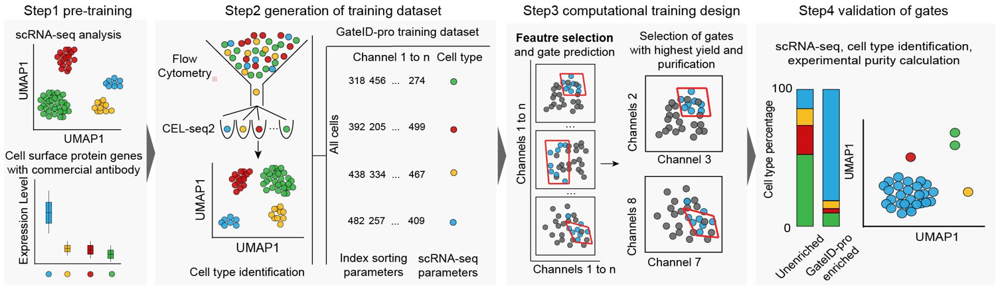

# CTSS: Cell-type purification strategies
## 1.	Introduction to CTPS
### 1.1	Overview of CTPS
The CTPS (Cell-Type-Purification Strategie) is designed to achieve high-purity cell sorting with minimal antibody reliance, by integrating flow cytometry data with single-cell transcriptomic data. CTPS total contains four steps: pre-training, generation of training dataset, computational training and validation of fates.



### 1.2 How to use CTPS
CTPS can be downloaded locally and used in R. Prior to use, the required dependent packages need to be installed.
```
R (version ≥ 4.3.3)
GA (version ≥ 3.2.4)
geometry (version ≥ 0.5.2)
sp (version ≥ 2.1-3)
Rmalschains (version ≥ 0.5.2)
overlap (version ≥ 0.2-10)
scales (version ≥ 1.3.0)
flowCore (version ≥ 2.14.2)
XML (version ≥ 3.99-0.16.1)
plyr (version ≥ 1.8.9)
affy (version ≥ 1.80.0)
grid (version ≥ 4.3.3)
caret (version ≥ 7.0-1)
e1071 (version ≥ 1.7.6)
pROC (version ≥ 1.18.5)
ggplot (version ≥ 3.5.1)
```
## 2.	Main functions of CTPS
### 2.1 Data preparation
Users are required to prepare a data file formatted identically to the example file in the `1-CTPS_example_data` directory, where the first column contains cell type annotations, and all subsequent columns hold the signal intensity values for each individual flow cytometry channel.

### 2.2 Flow cytometry channel selection
`CTPS_feature_selection.R` in `2-CTPS_feature_selection` is used to select channels to purificate target cells. Users need to specify the target cell type for sorting.
```
#parameter settings
target_cell_type = "Artery Cell"
```
Then, run the code and wait for a few minutes. The results will be generated and saved to the `Selected_feature.csv` file.

### 2.3 Run CTPS to create gate
`3-CTPS_gate_create/CTPS_gate_create.R` is used to create the sorting gates. Users also need to specify the target cell type here.  
The gate will save in `gate_result.csv` file, The visualized gating results are saved in the `gate_figure` folder like below:


